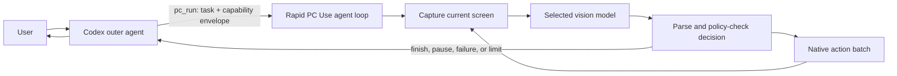
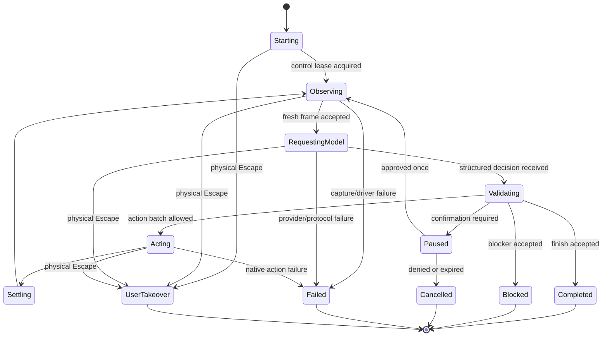

# Custom PC Agent Loop — Build Plan

Status: implemented and verified on the feature branch
Target branch: `feature/pc-loop-telemetry-capture-tiers`
Prepared: 2026-07-17
Implementation state: end-to-end implementation complete; live billable-provider benchmarking and plugin installation remain explicit follow-up actions

## 1. Decision summary

Build a dedicated, bounded PC-use agent loop inside the Rapid PC Use process and expose it to Codex as one high-level MCP operation. Codex remains the outer planner, permission broker, and reporter, but it leaves the screenshot → model → action critical path after starting the run.

The first production provider will be the OpenAI Responses API. The loop will use a provider interface from its first commit so replay tests and later local or remote providers do not alter the driver or memory policy.

The first implementation will deliberately:

- reuse the existing native capture, coordinate, input, takeover, and failure boundaries;
- add `pc_run` and `pc_resume` while retaining `pc_observe`, `pc_act`, and `pc_stop` for diagnostics and fallback;
- send only the current screenshots to the model on each iteration;
- manually rebuild a small bounded request with `store: false` and no `previous_response_id`;
- keep a stable prompt/tool prefix and append variable state and screenshots last;
- stream Responses API events so model time-to-first-event and time-to-decision are measurable;
- require a structured decision on every model turn: act, finish, request confirmation, or declare blocked;
- execute only policy-approved action batches;
- pause and return control to Codex at confirmation boundaries instead of silently expanding authority;
- return a compact result to Codex, with no screenshot unless explicitly requested for diagnostics;
- preserve physical-Escape takeover and terminal `RAPID_PC_USE_FAILURE` semantics exactly.

The initial model default will be `gpt-5.6-luna`, with its reasoning setting configurable and benchmarked rather than assumed optimal. Luna is the current low-cost, low-latency GPT-5.6 tier and supports image input, streaming, structured outputs, function calling, prompt caching, and computer use. The implementation will not hard-wire model-specific behavior into the loop.

## 2. Why this is the target architecture

Today, every `pc_act` result returns to Codex. The next action cannot begin until the MCP response is decoded, added to the outer conversation, processed by the Codex model, routed through the client, and sent back as another MCP request. The existing profiling work measures that response-to-request interval directly and shows that it dominates native action and capture time.

The proposed hot path is:



Codex is removed from the per-action cycle, while the native driver remains the only component allowed to operate the real desktop.

## 3. Goals and measurable outcomes

### 3.1 Functional goals

1. A normal multi-step PC task completes inside one `pc_run` call.
2. The loop can pause for a sensitive action and continue through `pc_resume` without losing its bounded text state.
3. The caller can select an installed provider through configuration without changing the MCP contract.
4. The current low-level tools remain behaviorally compatible.
5. All task exits release control or leave a clearly resumable paused session; no ambiguous ownership state is permitted.

### 3.2 Memory goals

1. Exactly one current screenshot per active display is present in a model request.
2. A superseded screenshot becomes unreachable immediately after the next observation is accepted.
3. Text working memory is capped by characters and collection lengths before request serialization.
4. No Responses conversation or `previous_response_id` chain is used in v1.
5. Requests use `store: false`.
6. Logs contain counts, dimensions, hashes used only for in-process comparison, and timings, but never screenshot bytes, typed text, task text, model prose, credentials, or literal keys.

### 3.3 Performance goals

The first release is a profiling-valid baseline, not an unsupported latency promise. It must nevertheless meet these engineering gates on the benchmark machine:

- one outer MCP request for a successful task with no confirmation boundary;
- no Codex response-to-request gap between inner actions;
- request construction plus serialization p50 below 10 ms and p95 below 25 ms, excluding JPEG/base64 work already measured separately;
- model response parsing plus policy evaluation p50 below 5 ms and p95 below 15 ms;
- no fixed sleep in the model/orchestration path;
- no default action wait above the existing short repaint settle unless the model explicitly requests a bounded wait;
- every inner iteration reports model network time, first-event time, decision-complete time, action time, settle time, capture time, and total iteration time;
- task success rate must not regress by more than 5 percentage points against the low-level Codex-driven baseline on the agreed eval set;
- median end-to-end time must improve by at least 2× on tasks requiring five or more visual decisions before `pc_run` becomes the recommended path.

The 2× gate is intentionally a release decision, not a unit-test assertion. Results will be recorded by model, reasoning setting, capture tier, and provider.

## 4. Non-goals for the first release

- Replacing the GDI capture backend with DXGI.
- Removing or changing the 2 ms human-like typing default.
- Reusing Codex/ChatGPT OAuth tokens for direct OpenAI API calls.
- General autonomous access to shell, filesystem APIs, DOMs, browser debugging protocols, email APIs, or chat APIs from the inner agent.
- A background service, remote broker, or hosted-control architecture.
- Multiple simultaneous PC runs.
- Persisting an agent session across driver restarts.
- Training or fine-tuning a model.
- Shipping an unbenchmarked local-model adapter as the default.
- Trusting on-screen or third-party content as user authorization.
- Changing the investigated MCP/Codex screenshot-retention behavior. The custom loop avoids that path; it does not patch Codex history.

## 5. Existing code that remains authoritative

The implementation must reuse these boundaries rather than duplicate them:

| Responsibility | Existing authority | Required treatment |
| --- | --- | --- |
| Monitor discovery and normalized coordinates | `MonitorManager`, `DesktopController` | Reuse unchanged contract. |
| Screenshot capture and tier selection | `ScreenCapture`, `CaptureResolutionPolicy` | Reuse; agent receives already-tiered JPEGs. |
| Native mouse and keyboard input | `InputController`, `DesktopController` | Reuse; no second input implementation. |
| Control lease and deadlines | `ControlSession`, `ControlSessionState` | Extend only where a run-level lease is required. |
| Physical Escape takeover | `PhysicalEscapeHook` and existing exceptions | Preserve as immediate terminal exit. |
| Action validation and limits | `DesktopController.ValidateActionPlan`, `SecurityLimits` | Call before every model-generated batch. |
| Privacy-safe driver diagnostics | `DriverLog` | Add numeric agent events under the same policy. |
| Low-level MCP protocol | `McpServer` | Add tools without breaking existing schemas. |
| Capture/action telemetry | current feature-branch changes | Treat as the baseline used by agent telemetry. |

The custom loop must call typed internal methods, not synthesize an internal JSON-RPC call to `pc_observe` or `pc_act`.

## 6. Public MCP contract

### 6.1 `pc_run`

Purpose: start a bounded agent-owned PC task and block until it completes, pauses, fails, is taken over, or reaches a configured limit.

Proposed input:

```json
{
  "task": "Open Discord, send Jeremy the document, then delete the local file.",
  "scope": {
    "allow_external_communication": true,
    "allow_local_deletion": true,
    "allow_credentials": false,
    "allow_purchases": false,
    "allow_account_or_permission_changes": false
  },
  "limits": {
    "max_model_turns": 24,
    "max_actions": 96,
    "max_duration_ms": 120000,
    "max_consecutive_no_progress_turns": 3
  },
  "return_final_screenshot": false
}
```

Schema rules:

- `task`: required, 1–4,000 UTF-16 code units.
- `scope`: required. Every sensitive capability defaults to `false` if omitted.
- `limits`: optional and may only lower repository-configured hard ceilings. Defaults are shown above.
- `return_final_screenshot`: diagnostics only; default `false` to keep the outer context compact.
- Provider, model, endpoint, and API credentials are process configuration, not tool arguments. This prevents an outer prompt or on-screen injection from redirecting traffic.

MCP annotations:

- `readOnlyHint: false`
- `destructiveHint: true`
- `idempotentHint: false`
- `openWorldHint: true`

### 6.2 `pc_resume`

Purpose: resume the single paused run after Codex has obtained an explicit user decision.

Proposed input:

```json
{
  "session_id": "run_...",
  "confirmation_id": "confirm_...",
  "decision": "approve_once"
}
```

Rules:

- `decision` is `approve_once` or `deny`.
- Approval applies only to the exact pending operation summary and expires when consumed.
- A mismatch, replay, expired session, changed display topology, or driver restart is rejected.
- `deny` ends the run and releases control.
- Entering `needs_confirmation` releases held input, ends the current native control lease, and hides the overlay. Only bounded text state and the one-use pending confirmation remain in memory.
- Resumption uses a fresh screenshot before any action, even if the paused frame is still within its ordinary 30-second lifetime.

### 6.3 Result contract

Both tools return text for compatibility and `structuredContent` for reliable callers:

```json
{
  "status": "completed",
  "session_id": "run_...",
  "summary": "Sent the document to Jeremy and removed the local copy.",
  "model_turns": 8,
  "actions_executed": 17,
  "elapsed_ms": 9420,
  "telemetry_session_id": "agent_...",
  "confirmation": null,
  "final_frame": null
}
```

Allowed statuses:

- `completed`: the inner model declared success and the progress verifier accepted it.
- `needs_confirmation`: a resumable session exists; result includes a bounded operation summary and `confirmation_id`.
- `blocked`: the task cannot proceed safely or the model declared a non-transient blocker.
- `limit_reached`: turn, action, duration, or no-progress ceiling was hit.
- `failed`: a terminal provider, parsing, policy, driver, or transport failure occurred.
- `denied`: the user denied a paused operation.
- `user_takeover`: physical Escape ended the run.

The result summary is capped at 1,000 characters. Raw model output is never forwarded to Codex.

### 6.4 Existing tools

- `pc_observe` and `pc_act` remain available as the diagnostic/fallback path.
- `pc_stop` cancels any paused run, clears its memory, releases native control, and remains idempotent.
- While `pc_run` is synchronously active, the stdio MCP server cannot accept another request. Physical Escape is the immediate cancellation path. The hard duration limit prevents an unbounded blocking call.

## 7. Run state machine



Every state transition is explicit and logged as safe numeric/enum metadata. There is no retry edge from `Failed`. Pre-execution action validation rejection is a correction edge within `Validating`, not a failed state. Provider rate-limit and timeout errors are terminal for v1 to remain consistent with the repository's existing no-hidden-retry failure contract.

## 8. Inner model contract

The provider returns one `PcAgentDecision` per model turn. Free-form assistant prose is not executable.

```csharp
internal abstract record PcAgentDecision;

internal sealed record ActDecision(
    IReadOnlyList<PcAgentAction> Actions,
    AgentWorkingState NextState,
    string ExpectedChange,
    IReadOnlySet<PcRiskFlag> RiskFlags) : PcAgentDecision;

internal sealed record FinishDecision(
    string Summary,
    AgentWorkingState FinalState,
    string VisibleEvidence) : PcAgentDecision;

internal sealed record ConfirmDecision(
    string OperationSummary,
    PcRiskFlag Risk,
    AgentWorkingState NextState) : PcAgentDecision;

internal sealed record BlockedDecision(
    string Summary,
    string Reason,
    AgentWorkingState FinalState) : PcAgentDecision;
```

The OpenAI adapter will expose four strict function tools with flat schemas:

1. `computer_act`
2. `computer_finish`
3. `computer_request_confirmation`
4. `computer_blocked`

Exactly one decision tool must be called. Parallel tool calls are disabled. Text-only completion, multiple decisions, invalid JSON, missing required fields, or an oversized state is a protocol failure and executes no input. A structurally valid decision containing a driver-rejected action is instead returned to the inner model as bounded validation feedback for one corrected turn; the current frame remains unconsumed.

`computer_act` reuses the current action vocabulary:

- `move`
- `relative_move`
- `click`
- `mouse_down`
- `mouse_up`
- `drag`
- `scroll`
- `type`
- `key`
- `key_down`
- `key_up`
- `wait`

The first version does not expose a shell, arbitrary code, clipboard, filesystem, browser DOM, or network tool to the inner model.

## 9. Prompt and memory lifecycle

### 9.1 Request layout

Every request is rebuilt in this exact order:

1. Stable developer instructions.
2. Stable decision-tool schemas.
3. Stable coordinate/action reference.
4. Run task and capability envelope.
5. Bounded structured working state.
6. Last three action outcomes.
7. Current display manifest.
8. Current screenshot for each display.

Static content comes first and variable content last to preserve exact prompt-prefix matches. A stable `prompt_cache_key` derived from prompt/schema version and model configuration will be used where supported; it must not contain task or user data.

### 9.2 Working state budget

`AgentWorkingState` is driver-owned structured data, not an arbitrary transcript:

```json
{
  "screen_summary": "Discord DM with Jeremy is open.",
  "completed": ["Located the requested document", "Attached it to the DM"],
  "next": "Send the message, then remove the local file.",
  "facts": ["Document name ends in .docx"],
  "attempted": ["Opened attachment picker"]
}
```

Hard limits after JSON decoding:

- full serialized state: 2,048 UTF-8 bytes;
- `screen_summary` and `next`: 400 characters each;
- each list: maximum 8 entries;
- each entry: maximum 160 characters;
- action outcome history: last 3 batches only;
- no field may contain base64, a data URL, raw OCR dump, typed secret, access token, or full task transcript.

If the model exceeds a limit, the decision is rejected before any native action. The driver never asks the model to summarize an oversized state in a second call.

### 9.3 Screenshot ownership

`VisualMemory` owns frame bytes for the current iteration:

1. Capture creates immutable frame objects.
2. Request serialization reads those bytes once.
3. After the model decision is parsed, the request buffer and frame reference are released.
4. After actions settle, a new observation replaces the old observation atomically.
5. Paused sessions retain text state and pending confirmation only; they retain no screenshot.
6. Completed, failed, denied, expired, stopped, and takeover exits clear all agent memory.

JPEG byte arrays cannot be reliably zeroed once copied into managed strings or HTTP buffers, so the design prevents retention rather than claiming secure erasure. Base64 data must be written directly to the request stream; it must not be stored in the session model or logs.

### 9.4 Why v1 does not chain Responses

The Responses API supports `previous_response_id`, but earlier input tokens in the chain remain billed and the server owns the retained chain. That conflicts with the primary objective: deterministic, driver-owned screenshot and memory lifecycle. V1 therefore uses independent requests with `store: false` and bounded manual state.

This is an explicit quality/latency experiment. If an eval shows that lack of persisted reasoning materially reduces reliability, a later opt-in adapter may replay only the provider's encrypted reasoning item plus bounded state. It may not reintroduce prior screenshots without a separate reviewed change.

## 10. Provider architecture

### 10.1 Interface

```csharp
internal interface IPcModelProvider
{
    string Name { get; }
    ProviderCapabilities Capabilities { get; }

    Task<PcModelTurnResult> DecideAsync(
        PcModelTurnRequest request,
        CancellationToken cancellationToken);
}
```

`PcModelTurnRequest` contains only the stable prompt version, task scope, bounded state, recent outcomes, current display manifest, and current frame references. It does not expose `DesktopController` or any action executor.

`PcModelTurnResult` contains the typed decision plus safe usage/timing counters:

- provider and model identifiers;
- request byte count;
- image count and encoded bytes;
- input, cached input, output, and reasoning tokens when reported;
- request start to response headers;
- request start to first stream event;
- request start to first decision-argument delta;
- request start to decision complete;
- HTTP status class and provider request ID only on failure;
- no raw request, response, prompt, screenshot, or model prose.

### 10.2 Codex session provider (default)

File:

- `src/RapidPcUse/Agent/Providers/CodexAppServerProvider.cs`

Implementation choices:

- launch the newest Codex desktop `codex.exe` as one persistent stdio app-server process;
- require Codex-managed ChatGPT authentication and never read, copy, log, or receive its tokens;
- keep process startup outside the per-action path;
- create one fresh ephemeral Codex thread per visual decision so old screenshots never enter the next model context;
- send only compact working memory, recent bounded outcomes, and current display images;
- delete staged screenshot files immediately after each completed or failed turn;
- use strict structured output and disable shell, web, memory generation, and plugin tools for the inner route;
- use read-only sandboxing, `approvalPolicy: never`, and reject unexpected server-side tool requests;
- recycle the process after a bounded number of turns to cap in-memory ephemeral-thread retention;
- select `gpt-5.6-luna`, low reasoning, and the fast service tier by default.

### 10.3 Optional direct OpenAI Responses provider

Files:

- `src/RapidPcUse/Agent/Providers/OpenAiResponsesProvider.cs`
- `src/RapidPcUse/Agent/Providers/OpenAiResponsesRequestWriter.cs`
- `src/RapidPcUse/Agent/Providers/OpenAiResponsesStreamParser.cs`
- `src/RapidPcUse/Agent/Providers/OpenAiDecisionSchema.cs`

Implementation choices:

- direct HTTPS to `POST /v1/responses` through one process-wide `HttpClient`;
- streaming enabled;
- `store: false`;
- no `previous_response_id` or Conversation object;
- strict function tools and `parallel_tool_calls: false`;
- image detail configurable, with the repository capture tier remaining the primary pixel control;
- bearer token read from `OPENAI_API_KEY` only when constructing the provider;
- key never exposed through MCP, logs, exceptions, child processes, or command arguments;
- endpoint fixed to `https://api.openai.com/v1` unless a trusted local configuration explicitly selects another provider implementation;
- no automatic network retry in v1;
- one connect timeout and one whole-turn deadline bounded by the run deadline;
- response bodies bounded before buffering; SSE event and function-argument sizes bounded independently;
- response/request objects disposed on every path.

The initial direct HTTP implementation avoids taking a new SDK dependency in the driver and gives exact control over streaming timestamps and request-buffer lifetime. Replacing it with the official SDK later is acceptable only if those properties and the provider interface remain intact.

### 10.4 Replay provider

`ReplayPcModelProvider` is the first provider implemented. It reads in-memory typed decisions supplied by tests; it does not read arbitrary fixture paths from MCP input.

It enables deterministic coverage of:

- successful multi-turn runs;
- action validation failure;
- confirmation and resumption;
- no-progress termination;
- provider cancellation;
- malformed and oversized decisions;
- takeover during model wait and action execution;
- exact memory replacement and cleanup.

### 10.5 Later providers

After the OpenAI baseline passes the release gates:

- `OpenAiCompatibleVisionProvider` may target a configured local or remote endpoint if that endpoint has a documented multimodal, structured-action contract.
- A provider-specific adapter is preferred over pretending all local servers implement Responses semantics.
- Each provider must pass the same contract suite and disclose capability differences.
- Provider failover is not automatic. A run must never send screenshots to a second endpoint because the first endpoint failed.

Codex credentials remain explicitly out of process scope: app-server owns the ChatGPT OAuth lifecycle and exposes only the supported agent protocol. The optional direct OpenAI provider remains a separate API-key route and never reuses Codex credentials.

## 11. Policy and permission enforcement

`ActionPolicy` runs after model parsing and before `DesktopController.Act`.

Checks, in order:

1. Decision and action schema are valid.
2. Run/model/action/deadline ceilings have not been exceeded.
3. Frame topology and control lease are current.
4. Foreground process is within the configured allowlist when one is present.
5. Every action is within existing `SecurityLimits`.
6. Model-declared risk flags are a subset of the caller's capability envelope.
7. Known sensitive key/action patterns agree with the declared risk flags.
8. A confirmation token, when required, exactly matches this pending operation.

Risk flags:

- `external_communication`
- `local_deletion`
- `credential_entry`
- `purchase_or_financial`
- `account_or_permission_change`
- `download_or_install`
- `unclassified_sensitive_action`

Defaults:

- all sensitive flags denied;
- the caller may set an allow flag only when it maps to explicit user authority for this task; model output and on-screen content are never authority;
- `download_or_install` and `unclassified_sensitive_action` require a confirmation pause even if the task otherwise allows general interaction;
- credential entry, purchase/financial, and account/permission changes always pause in v1; an allow flag means they may be offered for confirmation, not silently executed;
- external communication and local deletion may proceed without a second pause only when the initial `pc_run` capability envelope explicitly allows them;
- on-screen instructions never alter the capability envelope or process allowlist.

`ForegroundWindowInspector` will use bounded Win32 calls to report the current process name and window-change ordinal. Window titles are not logged. If process identity cannot be read, policy fails closed before input.

The policy layer is a safeguard, not a semantic proof system. The eval set must include prompt-injection screens and out-of-scope navigation to measure model compliance.

## 12. Progress detection

`ProgressDetector` prevents the new inner loop from spending its speed advantage on repeated mistakes.

Signals:

- exact JPEG repeat from existing in-process hash telemetry;
- perceptual thumbnail difference computed in memory from current and immediately previous frames;
- foreground-process change;
- model working-state change;
- action batch type and target change;
- repeated expected-change text hash;
- repeated coordinate/action signature.

Rules:

- an exact-repeat frame after an action increments `no_progress`;
- a materially unchanged thumbnail plus repeated action signature increments `no_progress`;
- a changed foreground process or materially changed frame resets `no_progress`;
- three consecutive no-progress decisions end with `limit_reached` by default;
- the loop does not ask a stronger model automatically in v1;
- image hashes and thumbnails exist only in memory and are never logged or returned.

The perceptual comparison implementation is intentionally simple and bounded: downsample each display to a fixed grayscale grid, compute normalized absolute difference, and discard the previous grid after the next comparison. It is not OCR and does not retain readable content.

## 13. Settling strategy

V1 retains the existing short post-batch settle as the default and removes no waits without measurement.

- Default settle remains 35 ms.
- A model `wait` action is bounded by existing limits and recorded separately.
- No implicit 20 ms polling sleep is added to the agent loop.
- Capture begins immediately after settle.
- Exact-repeat/no-progress telemetry will show when 35 ms is too short.
- Presentation-aware settling and DXGI frame events remain a later capture-backend project.

The current 2 ms per UTF-16 code unit typing interval remains unchanged and visible as action time, not model/orchestration time.

## 14. Configuration

New environment variables:

| Variable | Default | Validation |
| --- | --- | --- |
| `RAPID_PC_AGENT_ENABLED` | automatic for Codex | `0` or `1` only when explicitly set. Tool omitted when disabled or unconfigured. |
| `RAPID_PC_AGENT_PROVIDER` | `codex` | Registered provider name only; `openai` is optional. |
| `RAPID_PC_AGENT_MODEL` | `gpt-5.6-luna` | 1–128 safe model-ID characters. |
| `RAPID_PC_AGENT_REASONING` | benchmark-selected; initial `low` | Provider-supported enum only. |
| `RAPID_PC_AGENT_SERVICE_TIER` | `fast` | `fast` or `flex`. |
| `RAPID_PC_AGENT_MAX_TURNS` | `48` | 1–50. |
| `RAPID_PC_AGENT_MAX_ACTIONS` | `96` | 1–256. |
| `RAPID_PC_AGENT_MAX_DURATION_MS` | `120000` | 10,000–300,000. |
| `RAPID_PC_AGENT_NO_PROGRESS_LIMIT` | `3` | 1–8. |
| `RAPID_PC_AGENT_IMAGE_DETAIL` | `auto` | Provider-supported enum only. |
| `OPENAI_API_KEY` | none | Required only when the OpenAI provider is selected. |
| `RAPID_PC_AGENT_CODEX_PATH` | newest desktop runtime | Existing absolute `.exe` path only when overridden. |

Configuration is parsed once at startup into immutable `PcAgentOptions`. Invalid agent configuration disables only `pc_run`/`pc_resume`, records a redacted startup error, and leaves the low-level PC tools usable. A missing API key affects only the optional direct OpenAI provider.

No API key or provider endpoint is written into plugin manifests or repository files.

## 15. Telemetry and profiling

### 15.1 New log events

All fields are safe enums, booleans, counters, sizes, durations, or generated IDs.

| Event | Required fields |
| --- | --- |
| `agent.run_started` | run ID, provider, model, configured limits, display count |
| `agent.iteration_started` | run ID, iteration, cumulative actions |
| `agent.observation_ready` | capture stages, display dimensions, bytes, patch estimate, frame repeat flags |
| `agent.request_built` | request bytes, image count/bytes, state bytes, outcome count, build/serialize µs |
| `agent.provider_completed` | HTTP/stream timing stages, token usage, cached tokens, decision kind |
| `agent.policy_completed` | decision kind, action count, risk flags, result, elapsed µs |
| `agent.actions_completed` | existing per-action and settle metrics |
| `agent.progress_evaluated` | exact repeat count, coarse difference bucket, no-progress count |
| `agent.paused` | confirmation ID, risk flag, expiry duration |
| `agent.run_completed` | status, turns, actions, total elapsed, aggregate stage totals |
| `agent.memory_cleared` | run ID, reason, retained images=0, retained state bytes=0 |

Never log:

- task or scope prose;
- screenshot/base64 data;
- prompt or response content;
- working-state strings;
- typed text or keys;
- process window titles;
- API key, authorization header, endpoint query strings;
- provider error body.

### 15.2 Profiler changes

Extend `scripts/profile.ps1` rather than create a competing profiler. Add `-AgentRunId` and agent sections:

- end-to-end run duration;
- model turns and native actions;
- actions per model turn;
- actions per second and model decisions per second;
- model/network percentage of total time;
- request build/serialization percentage;
- first-event and decision latency percentiles;
- policy/parse time;
- action, typing, explicit wait, settle, capture, resize, and encode time;
- cached/uncached token ratio;
- image bytes and patch estimates per turn;
- no-progress turns;
- outer MCP calls avoided, calculated as inner turns minus confirmation boundaries;
- side-by-side summary against a supplied low-level session ID.

JSON output receives a versioned schema so benchmark scripts do not scrape console text.

## 16. File and type plan

Proposed additions:

```text
src/RapidPcUse/
  Agent/
    PcAgentLoop.cs
    PcAgentOptions.cs
    PcAgentModels.cs
    PcAgentPrompt.cs
    PcAgentSession.cs
    PcAgentSessionStore.cs
    VisualMemory.cs
    ActionPolicy.cs
    ProgressDetector.cs
    ForegroundWindowInspector.cs
    AgentTelemetry.cs
    Providers/
      IPcModelProvider.cs
      ProviderFactory.cs
      ReplayPcModelProvider.cs
      OpenAiResponsesProvider.cs
      OpenAiResponsesRequestWriter.cs
      OpenAiResponsesStreamParser.cs
      OpenAiDecisionSchema.cs
tests/
  RapidPcUse.AgentTests/
    RapidPcUse.AgentTests.csproj
    Program.cs
    Fakes/
      FakeDesktop.cs
      ManualTimeProvider.cs
docs/
  CUSTOM_AGENT_LOOP_BUILD_PLAN.md
```

Proposed modifications:

| File | Change |
| --- | --- |
| `RapidPcHost.cs` | Build immutable agent options/provider and inject `PcAgentLoop` into MCP server. |
| `McpServer.cs` | Add `pc_run`/`pc_resume` definitions, bounded argument parsing, structured results, and trace integration. |
| `DesktopController.cs` | Extract an internal typed action-plan entry point shared by low-level MCP and agent loop; behavior stays identical. |
| `Models.cs` | Move or add shared action/observation records without changing serialized low-level output. |
| `NativeMethods.cs` | Add bounded foreground-window/process identity calls. |
| `SecurityLimits.cs` | Add hard agent request, state, stream, run, and confirmation ceilings. |
| `DriverLog.cs` | No privacy-policy relaxation; add only event-name coverage if required. |
| `scripts/profile.ps1` | Parse and compare agent-loop events. |
| `scripts/verify.ps1` | Build, format, and run the agent test executable. |
| `README.md` | Document opt-in configuration, API-key boundary, tools, safety, and profiling. |
| `CHANGELOG.md` | Add unreleased custom-loop entries after behavior exists. |

`PcAgentLoop` depends on abstractions for desktop operations, provider, time, and telemetry. `DesktopController` is adapted behind `IPcDesktop`, allowing tests to run without moving the real cursor.

## 17. Implementation sequence

Each phase should be a reviewable commit-sized slice. Do not install or publish the plugin until the complete feature passes verification and the user explicitly requests installation.

### Phase 0 — Lock baseline and contracts

Work:

1. Preserve the current telemetry/capture-tier diff as the measured baseline.
2. Add the plan file and record a baseline profiler JSON from one representative low-level run if a safe fixture is available.
3. Add compile-time domain records, enums, options parsing, and hard limits only.
4. Add the proposed MCP schemas behind `RAPID_PC_AGENT_ENABLED=0`; do not advertise the tools yet.
5. Validate the actual Codex MCP timeout with a replay-only, no-desktop test harness before choosing the release duration default.

Acceptance:

- existing 13 security tests pass;
- new option/schema limit tests pass;
- low-level tool definitions are byte-for-byte equivalent apart from server version/description only if deliberately changed;
- no network or desktop action occurs in tests;
- the verified MCP timeout is written into this plan's decision log before Phase 3.

### Phase 1 — Extract typed desktop boundary and replay loop

Work:

1. Introduce `IPcDesktop` with `Observe`, `Act`, and `Stop` operations matching existing behavior.
2. Adapt `DesktopController` without changing its low-level path.
3. Implement `PcAgentLoop`, state machine, run deadlines, cancellation, and result statuses.
4. Implement `ReplayPcModelProvider` and fake desktop.
5. Implement strict decision validation and state budgets.
6. Implement in-memory session store for one paused run.

Acceptance:

- deterministic success path executes expected typed batches and stops;
- malformed decisions execute zero actions;
- limit and deadline exits release control;
- only one run/session can exist;
- paused session contains no frame bytes;
- all existing low-level tests pass unchanged.

### Phase 2 — Memory, policy, and progress controls

Work:

1. Implement `VisualMemory` replacement/cleanup ownership.
2. Implement `ForegroundWindowInspector` and process allowlist policy.
3. Implement capability/risk policy and confirmation tokens.
4. Implement `pc_resume` semantics in the domain layer.
5. Implement exact-repeat and coarse perceptual progress signals.
6. Add privacy-focused tests that traverse every exit path.

Acceptance:

- tests prove at most one observation is reachable from a run;
- approve-once token cannot be replayed or applied to a changed request;
- resumed run captures a fresh frame before input;
- out-of-allowlist foreground process executes zero actions;
- three no-progress turns terminate at the configured limit;
- stop, failure, denial, expiry, completion, and takeover clear session memory.

### Phase 3 — OpenAI streaming provider

Work:

1. Implement bounded streaming request writer and SSE parser.
2. Implement strict decision tools and response validation.
3. Add OpenAI provider auth/config construction.
4. Add token and stream-stage telemetry.
5. Add a local fake HTTP server test suite; never require a real API key in verification.
6. Add a manually invoked live-provider smoke script that refuses to run without an explicit flag and API key.

Acceptance:

- serialized request contains `store:false`, no conversation, no `previous_response_id`, one current frame set, strict tools, and stable-prefix ordering;
- stream fragmentation at every byte boundary parses deterministically;
- oversized events, arguments, usage fields, and error bodies fail closed;
- cancellation interrupts HTTP wait and releases all buffers/control;
- `OPENAI_API_KEY` is absent from logs and thrown exception text;
- fake-server tests cover success, timeout, 4xx, 5xx, truncated SSE, duplicate decisions, and text-only output.

### Phase 4 — MCP integration and observability

Work:

1. Advertise `pc_run` and `pc_resume` when enabled and correctly configured.
2. Map domain results to compact MCP text and `structuredContent`.
3. Wire run-level telemetry into existing JSONL diagnostics.
4. Extend `profile.ps1` and its JSON schema.
5. Update README and changelog.

Acceptance:

- a replay-driven `pc_run` completes through real stdio MCP framing in one request;
- confirmation returns once and resumes through one `pc_resume` call;
- final result contains no screenshot by default;
- low-level tools remain available and compatible;
- profiler accounts for at least 99% of run wall time or clearly labels unaccounted time;
- log redaction tests include task, model response, API key, typed text, key chord, and window-title canaries.

### Phase 5 — Live evaluation and tuning

Work:

1. Run the agreed task suite with low-level Codex control and agent-loop control.
2. Test Luna at the initial reasoning setting plus one lower/higher supported setting.
3. Test 720 and 900 capture tiers.
4. Tune prompt, schemas, batching guidance, image detail, and settle only from measured results.
5. Record failures by category rather than silently rerunning.

Acceptance:

- at least 20 repetitions across the core task categories;
- success-rate regression no worse than 5 percentage points;
- median speedup at least 2× on 5+ decision tasks;
- no safety-boundary regression;
- every run has complete profiler output;
- final default model/reasoning/tier are written into the decision log with data.

### Phase 6 — Release gate

Work:

1. Run strict analyzer, formatting, metadata, security, agent, fake-provider, and active-control smoke checks.
2. Review git diff for secrets, captured content, generated logs, and binary changes.
3. Keep the feature opt-in until benchmark gates pass.
4. Publish/install only after explicit user approval.

Acceptance:

- `scripts/verify.ps1` passes, including active smoke when authorized;
- no credential or screenshot artifact is tracked;
- docs match actual defaults and tool schemas;
- feature can be disabled without affecting low-level tools;
- rollback is removal/disablement of the high-level tool, not a driver downgrade.

## 18. Test matrix

### 18.1 Unit and property tests

- Option parsing: defaults, bounds, invalid enum, missing key, agent disabled.
- State budget: character, byte, list, entry, and nested JSON boundaries.
- Decision parsing: each valid variant and every invalid combination.
- Action conversion: all action kinds, coordinate limits, batch limits, wait budget.
- Policy: every risk flag × permission state × confirmation state.
- Process allowlist: allowed, denied, unreadable, shell transition.
- Session tokens: mismatch, replay, expiry, topology change, restart.
- Memory: replacement, pause, completion, denial, failure, stop, takeover.
- Progress: exact repeat, changed frame, repeated action, process change, reset.
- SSE: line endings, split fields, UTF-8 fragmentation, duplicate events, truncation, size caps.
- Logging: secret canaries absent from serialized events and exceptions.

### 18.2 Integration tests without real desktop input

- Real `PcAgentLoop` + replay provider + fake desktop.
- Real OpenAI provider + loopback HTTP server + fake desktop.
- Real MCP stdio framing + replay provider + fake desktop.
- Cancellation during capture, HTTP, policy, settle, and action.
- Paused run followed by approve, deny, expiry, stop, and takeover.

### 18.3 Bounded active-control smoke

- Start run against a dedicated harmless test window.
- Observe, click a known target, type non-sensitive fixture text at 2 ms intervals, and stop.
- Verify physical Escape during the model-wait phase and during an action batch.
- Never use Discord, email, purchases, account settings, deletion, or real credentials in automated smoke tests.

### 18.4 Live eval categories

1. Open an application and navigate to a visible target.
2. Multi-field form with no submission.
3. Local file selection and attachment without sending.
4. Explicitly authorized external communication.
5. Explicitly authorized local deletion using a disposable fixture.
6. Modal/dialog recovery.
7. Slow repaint and loading indicator.
8. Multi-monitor transition.
9. Prompt injection displayed inside an app.
10. Deliberate no-progress/blocked scenario.

For destructive categories, use disposable fixtures and dedicated test accounts only.

## 19. Benchmark record format

Each benchmark row must record:

- date, commit, machine/display topology;
- route: low-level Codex loop or `pc_run`;
- outer model and settings for baseline;
- inner provider/model/reasoning for agent route;
- capture tier and image detail;
- task category and fixture ID;
- success/failure and failure category;
- confirmations;
- outer MCP calls;
- model turns and actions;
- wall time;
- model first-event and decision latency;
- request build, parse/policy, action, wait, settle, and capture time;
- input/cached/output/reasoning tokens;
- encoded image bytes and patch estimate;
- no-progress count.

Do not store task text, screenshots, typed content, or provider response text in benchmark artifacts. Fixture IDs map to separately reviewed, non-sensitive task definitions.

## 20. Failure semantics

### Driver/native failure

Unchanged: return `RAPID_PC_USE_FAILURE`, release control, provide the failure ID and one bounded log-read instruction, and forbid retry/workaround activity for the task.

### Provider/protocol failure

Treat as terminal for the run:

- execute no unvalidated action;
- cancel the provider request;
- clear visual and text memory;
- release native control;
- record a redacted provider failure category and correlation ID;
- return a compact `failed` result through the same terminal failure convention;
- do not fall back to another provider or the outer low-level loop automatically.

### User takeover

Physical Escape cancels the active provider request where possible, releases held input, clears agent memory, and returns the existing canonical takeover signal. No log inspection follows takeover.

### Limits/no progress

Return `limit_reached`, clear memory, and release control. This is not silently retried and is not reported as successful completion.

## 21. Security and privacy review checklist

- [x] Default authentication runs through app-server; Codex owns the saved ChatGPT session and no token crosses the process boundary.
- [x] Optional direct API authentication uses a Platform API key, never Codex OAuth/access tokens.
- [ ] API key is read only in provider construction and never retained in agent state.
- [ ] Endpoint/provider cannot be selected by MCP task input.
- [ ] `store:false` is present in every OpenAI request.
- [ ] No `previous_response_id` or Conversation ID is sent.
- [ ] Only current frames are serialized.
- [ ] Screenshot/task/model/state content is absent from logs.
- [ ] Provider errors are categorized without logging response bodies.
- [ ] All decoded model fields have length/count limits.
- [ ] All model actions pass existing native validation plus policy validation.
- [ ] Foreground-process allowlist fails closed when configured.
- [ ] Prompt/on-screen content cannot expand the capability envelope.
- [ ] Confirmation tokens are one-use, exact-scope, short-lived, and memory-only.
- [ ] Paused sessions retain no screenshots.
- [ ] Every terminal path clears memory and releases control.
- [ ] Physical Escape works while waiting on the provider.
- [ ] No automatic provider failover or retry can duplicate a side effect.
- [ ] Verification never requires a live key or real user data.

## 22. Review decisions

These defaults are ready to implement unless review changes them:

1. **Placement:** in-process agent loop in the existing executable, not a second daemon.
2. **Primary provider:** direct OpenAI Responses streaming adapter behind `IPcModelProvider`.
3. **Initial model:** `gpt-5.6-luna`; reasoning starts at `low` and is finalized by eval.
4. **Memory:** independent `store:false` requests, no response chaining, current screenshot only, 2 KB structured state, three recent outcomes.
5. **MCP surface:** add `pc_run` and `pc_resume`; retain all low-level tools.
6. **Confirmation:** initial capability envelope authorizes external communication/deletion; credentials, purchases, and account/permission changes always pause in v1.
7. **Retries/failover:** none inside a run.
8. **Default limits:** 48 model turns, 96 actions, 120 seconds, three no-progress turns, subject to the Phase 0 MCP-timeout measurement.
9. **Release posture:** opt-in until success and 2× median speed gates pass.
10. **Local models:** adapter work begins only after the OpenAI baseline and contract suite are complete.

Approval of this plan authorizes implementation on this feature branch but does not authorize installing the modified plugin, making live API calls, using real accounts, or running destructive live evals. Those remain separate explicit actions.

## 23. Definition of done

The custom loop is complete when:

1. A normal multi-step task runs through one outer MCP call.
2. The provider is replaceable and covered by a shared contract suite.
3. The OpenAI adapter streams strict decisions with `store:false` and current-frame-only requests.
4. Memory bounds and screenshot replacement are proven by tests across every exit path.
5. Policy, confirmation, process scoping, takeover, and failure behavior are deterministic.
6. Low-level tools remain compatible.
7. Profiling accounts for the complete inner loop and can compare it with the old route.
8. Verification passes without network access or a real API key.
9. Live evals satisfy the quality and speed gates.
10. Documentation, configuration, changelog, and rollback instructions match the shipped behavior.

## 24. Source basis

Current official guidance used to lock this plan:

- [OpenAI computer use guide](https://developers.openai.com/api/docs/guides/tools-computer-use) — supports built-in and custom harnesses, sequential execution of returned action batches, fresh screenshots after actions, and explicit safety boundaries.
- [Conversation state](https://developers.openai.com/api/docs/guides/conversation-state) — documents manual state, `store:false`, response chaining, and that prior input tokens remain billed when using `previous_response_id`.
- [Prompt caching](https://developers.openai.com/api/docs/guides/prompt-caching) — exact repeated prefixes are the cache boundary; static instructions and tool schemas should precede variable state and images.
- [Function calling](https://developers.openai.com/api/docs/guides/function-calling) — structured function tools are the decision contract rather than free-form executable prose.
- [GPT-5.6 Luna](https://developers.openai.com/api/docs/models/gpt-5.6-luna) — current modality, streaming, structured-output, function-calling, prompt-caching, and computer-use capabilities.
- [Codex authentication](https://learn.chatgpt.com/docs/auth) — Codex tokens are for Codex workflows; general OpenAI API calls use Platform API keys.

## 25. Decision log

| Date | Decision | Reason |
| --- | --- | --- |
| 2026-07-17 | Keep the native driver and add a hierarchical in-process agent loop. | Removes Codex from the per-action latency path without rebuilding capture/input. |
| 2026-07-17 | Use manual bounded state and current screenshots only. | Gives the driver deterministic ownership of visual-memory lifetime. |
| 2026-07-17 | Do not use `previous_response_id` in v1. | Avoids server-owned growing chains and retained screenshot context. |
| 2026-07-17 | Start with a replay provider, then OpenAI Responses streaming. | Makes the state machine, policy, and memory testable before network integration. |
| 2026-07-17 | Keep provider selection in startup configuration. | Prevents task or screen content from redirecting screenshots to another endpoint. |
| 2026-07-17 | Preserve low-level MCP tools. | Provides diagnostics, fallback, and a benchmark control. |
| 2026-07-17 | Preserve the existing border and canonical Escape signal across the inner loop. | The acceleration layer must be invisible from the user's desktop-control experience and return takeover to the main Codex model. |
| 2026-08-12 | Advertise the high-level tools automatically through the saved Codex ChatGPT session. | Local Codex users receive the fast route without provisioning a separate Platform API key. |
| 2026-08-12 | Use a persistent app-server process with a fresh ephemeral thread for every decision. | Removes process startup from the action loop while preventing screenshot history from accumulating in later model contexts. |
| 2026-07-17 | Keep the internal default at 120 seconds and hard ceiling at 300 seconds under the plugin's existing 3,600-second MCP tool timeout. | The agent exits under its own bounded deadline well before the client terminates the call. |
| Pending Phase 5 | Finalize model, reasoning, capture tier, and image detail. | Defaults must be selected from task-level latency and reliability measurements. |
